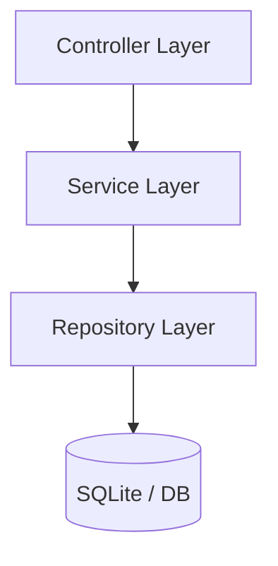

# Project Architecture Overview (ARCHITECTURE.md)

## Architectural Integrity
- **Overall Architecture Grade**: D (Score: 67/100)
- **Architecture Drift**: 0.0%

## Health Dimension Scores
- **Architecture**: 90/100 (A)
  - *Strengths*: Proper layering with no detected violations., Low coupling among classes.
  - *Improvements*: Missing standard Service layer., Missing standard Controller layer.
- **Naming Consistency**: 90/100 (A)
  - *Improvements*: No distinct naming conventions discovered.
- **Security**: 50/100 (F)
  - *Improvements*: No clear security configuration detected.
- **Testing**: 70/100 (C)
- **Maintainability**: 75/100 (C+)
  - *Strengths*: No massive God classes detected.
- **AI Readiness**: 30/100 (F)
  - *Improvements*: Unclear or missing architectural layering., Inconsistent naming makes AI interpretation harder.

## Mermaid Component/Layer Diagram

