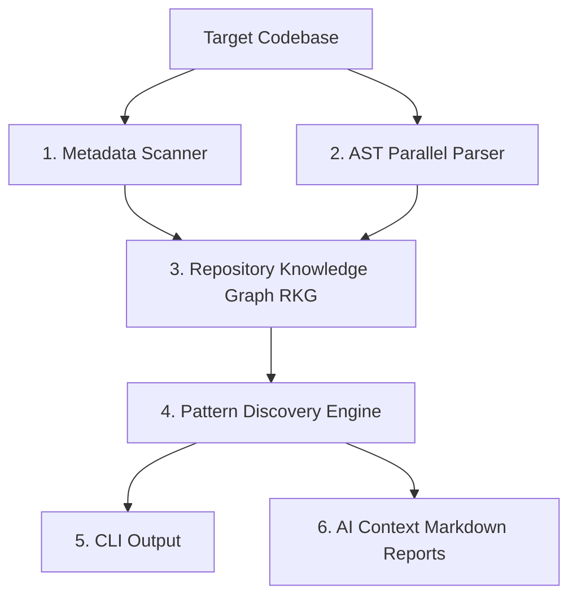

# RepoDNA 🧬
> **Engineering Intelligence Layer** — teaching AI assistants how your team builds software.

RepoDNA is a high-performance, deterministic static analysis CLI that scans, parses, and maps a codebase's engineering patterns. Instead of relying on subjective code reviews or LLM hallucinations, RepoDNA extracts factual coding signatures directly from code syntax to automatically generate tailored configuration contexts for AI coding assistants (such as Cursor, Claude, and Gemini).

---

## 🛠️ How It Works (Pipeline Architecture)

RepoDNA processes your repository through a sequential, deterministic compilation pipeline:



1. **Metadata Scanner**: Walk the workspace to detect languages, build systems, framework configurations, and statistics while honoring `.gitignore` rules.
2. **AST Parser**: Parses Java files in parallel using JavaParser and JavaSymbolSolver to resolve types, annotations, fields, method call sites, and inheritance.
3. **Repository Knowledge Graph (RKG)**: Constructs an in-memory, thread-safe graph indexing classes, packages, interfaces, methods, and configurations as relational nodes and edges.
4. **Pattern Discovery Engine**: Applies statistical algorithms to discover naming suffixes, Spring injection styles, transaction placement, test suffix conventions, package boundaries, and circular dependencies.
5. **AI Context Generator**: Automatically writes structured context files (`REPO_DNA.md`, `AGENTS.md`, `ARCHITECTURE.md`, `PROJECT_RULES.md`) containing custom AI instructions, DOs/DONTs, and diagrams.

---

## ✨ Key Features

* **Zero subjective guessing**: Rules and confidence scores are calculated using mathematical support formulas.
* **Outlier Detection**: Instantly flags conventions and files violating established patterns.
* **AI Ready Context**: Translates architectural boundaries and naming rules into AI instructions so LLMs generate code aligned with your existing patterns.
* **Snapshot Evolution comparison**: Compares repository snapshots to track pattern drift, strengthening, or weakening over commits.
* **Fast Caching**: Caches discovered pattern metrics to scale gracefully to repositories containing millions of lines of code.

---

## 🚀 Getting Started

### Prerequisites
- **Java 21+** (JDK 21 or higher)
- **Git**

### 1. Build the Project
Clone the repository and build the fat shadow JAR:
```bash
./gradlew shadowJar
```

### 2. Initialize RepoDNA in a Repository
Navigate to the directory of your Java project and initialize the configuration directory:
```bash
/path/to/repo-dna/bin/repo-dna init
```
*This configures the `.repo-dna/` directory layout for logs, caching, and reports.*

### 3. Run Repository Analysis
Analyze the codebase structure, conventions, and patterns:
```bash
/path/to/repo-dna/bin/repo-dna analyze .
```
This prints a summary of discovered patterns, confidence, and anomalies directly to your terminal, and writes four context files to your repository root:
* `REPO_DNA.md` — Detailed statistical profile of all discovered patterns.
* `AGENTS.md` — Custom AI instructions defining strict **DOs** and **DONTs** for code generation.
* `ARCHITECTURE.md` — Integrity grading, dimension health, and package dependency Mermaid diagrams.
* `PROJECT_RULES.md` — Enforceable guidelines generated from codebase metrics.

### 4. Query & Explain Discovered Rules
Look up the detailed evidence and list of violations/outliers for any specific pattern:
```bash
/path/to/repo-dna/bin/repo-dna explain test-naming-test
```
Options:
- `-d`, `--dir`: Specify target directory path (defaults to `.`).
- `--verbose`: View the full list of evidence and conformant nodes.

---

## 📊 Discovered Categories & Patterns

RepoDNA is capable of detecting coding signatures across a variety of categories:

| Category | Patterns Discovered | Confidence Metrics |
|---|---|---|
| **Naming Suffixes** | RestController, Service, Repository, DTO/Dto, Request, Response, Exception suffixes | Conforming files vs. candidate files |
| **Spring Framework** | Constructor vs. Field dependency injection style, Class-level vs. Method-level `@Transactional` placement | Support / Violations ratio |
| **Testing Conventions** | `Test`, `Tests`, and `IT` suffixes for test class naming | Conformance frequency |
| **Dependency Boundaries** | Package boundary coupling, high-coupling anomaly thresholds, circular dependencies | Coupling index & DFS cycle path |

---

## 📈 Developer Command Summary

```bash
# Display help menu
repo-dna --help

# Check version and build details
repo-dna version

# Initialize RepoDNA layout
repo-dna init

# Run analysis and export reports
repo-dna analyze [target-path]

# Inspect rule details and code evidence
repo-dna explain [rule-id] --verbose
```

---

## 🧪 Running Tests
RepoDNA is fully covered by unit tests verifying parsing, graph structures, index mapping, and pattern discovery:
```bash
./gradlew test
```
